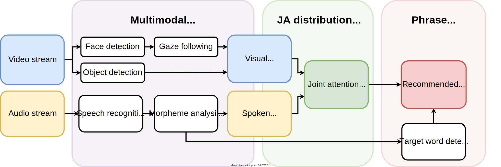
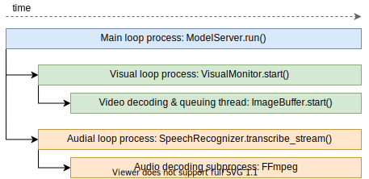

# Captivate! Contextual language guidance for Parent–Child Interaction
This repo contains the server-side source code for **Captivate!**, a system 
that analyzes real-time video and audio streams to provide language guidance 
for parents in play situations.


## System overview
The system separately processes video and audio streams, with the goal
of extracting attention-related cues and combining them to infer a *joint
attention distribution*. The joint attention distribution provides the basis
for the context-relevant phrases that are recommended to the parent in
real-time. Below is an overview of the system.




## Code overview
The processing pipline for video and audio is in the `modelserver` directory.
The main process is `modelserver.modelserver.run_server.py`, wihch starts
several parallel processes that fetch and handle real-time data streams from an 
RTMP video server. Each process writes model inference outputs to a shared
queue in the main process, which combines the information to calculate the
joint attention distribution.



In our study, we used three cameras, so therefore launch three visual processes
that perform the same pipeline on each of the video streams. Note that this
number can be changed easily.

Finally, communication between the server and client is done in real-time
with WebSockets.


## Running
Currently the code serves mainly as a reference, as running takes quite a bit
of setup (and the client code is not open yet). 
That said, the Docker image for the modelserver can be built and
run with.

```sh
./build.sh
./run.sh
```


## Acknowledgements
We would like to thank and mention the following repositories and their authors
for providing the models used in this system.

- Gaze following: https://github.com/ejcgt/attention-target-detection
- Face detection: https://github.com/deepinsight/insightface
- Object detection: https://github.com/facebookresearch/detectron2
- Korean morpheme analysis: https://github.com/kakao/khaiii
